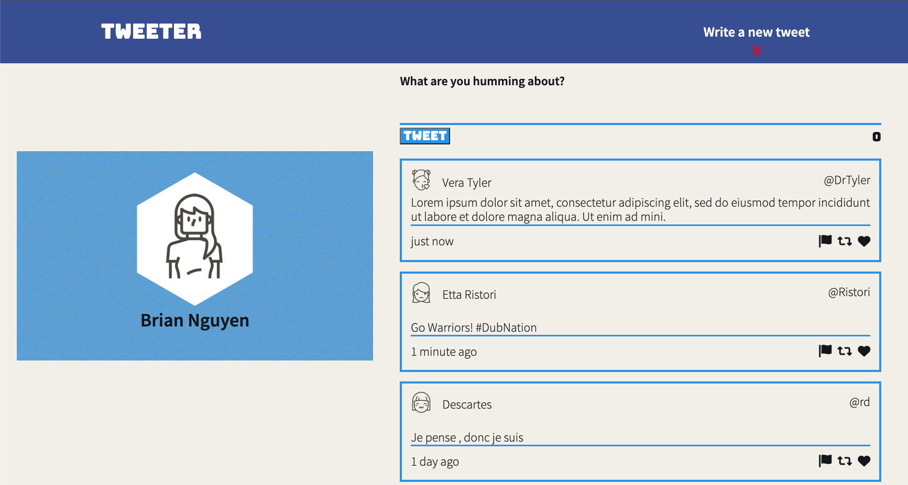
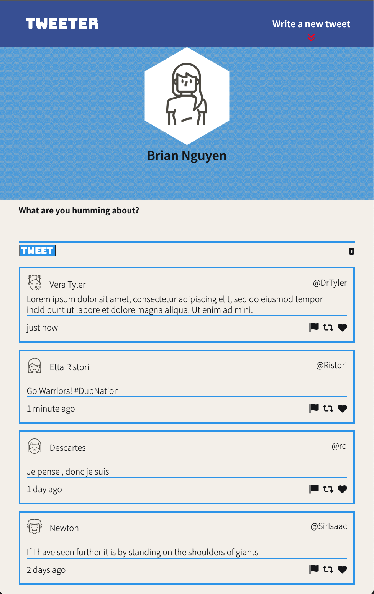

# Tweeter Project

Tweeter is a simple, single-page Twitter clone.

This is our main project for our front-end development section at Lighthouse Labs. It is meant to teach and help use practice our HTML, CSS, JS, jQuery and AJAX front-end skills, and our Node, Express back-end skills.

## Getting Started

1. Clone your repository onto your local device.
2. Install dependencies using the `npm install` command.
3. Start the web server using the `npm run local` command. The app will be served at <http://localhost:8080/>.
4. Go to <http://localhost:8080/> in your browser.
5. Click on the red arrow in the top right to get started tweeting!

## Dependencies

- Express
- Node 5.10.x or above
- body-parser
- chance
- md5

## Screenshots

### Desktop View

### Mobile View

